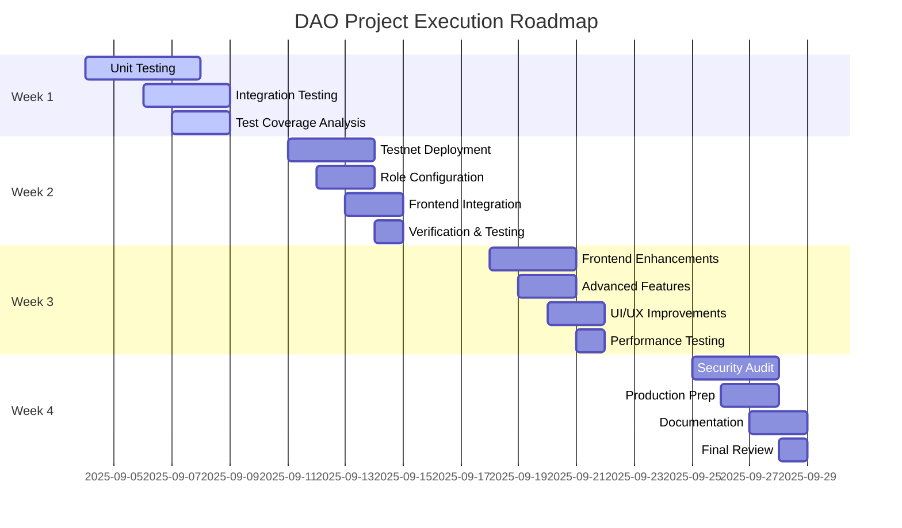

# DAO Project Roadmap

## 4-Week Execution Plan

## Detailed Week-by-Week Breakdown

### Week 1: Testing (September 4-8, 2025)

#### Day 1-2: Unit Testing
- [ ] GovernanceToken unit tests (minting, burning, delegation)
- [ ] MyGovernor unit tests (proposal creation, voting)
- [ ] Treasury unit tests (ETH/ERC20 transfers, streaming)
- [ ] MembershipNFT unit tests (minting, burning, ownership)

#### Day 3-4: Integration Testing
- [ ] Full governance flow testing (propose → vote → queue → execute)
- [ ] Emergency controls testing (guardian cancellation)
- [ ] Treasury operations testing (multi-asset support)
- [ ] Membership NFT integration testing

#### Day 5: Test Coverage Analysis
- [ ] Run coverage reports for all contracts
- [ ] Identify gaps in test coverage
- [ ] Implement additional tests for edge cases
- [ ] Target: 90%+ coverage for all contracts

### Week 2: Testnet Deployment (September 11-15, 2025)

#### Day 1-2: Testnet Deployment
- [ ] Deploy contracts to Goerli/Sepolia testnet
- [ ] Verify contracts on Etherscan
- [ ] Document deployment parameters
- [ ] Create deployment checklist

#### Day 3: Role Configuration
- [ ] Configure TimelockController roles
- [ ] Set up Guardian roles
- [ ] Transfer ownership to Timelock
- [ ] Verify all role assignments

#### Day 4: Frontend Integration
- [ ] Update contract addresses in frontend config
- [ ] Test wallet connection
- [ ] Verify proposal creation flow
- [ ] Test voting functionality

#### Day 5: Verification & Testing
- [ ] End-to-end testing of all features
- [ ] Performance testing under load
- [ ] Security testing of access controls
- [ ] Document any issues found

### Week 3: Frontend + Advanced Features (September 18-22, 2025)

#### Day 1-2: Frontend Enhancements
- [ ] Implement enhanced proposal creation form
- [ ] Add metadata fields (title, description, category)
- [ ] Implement IPFS CID upload functionality
- [ ] Add advanced filtering and sorting

#### Day 3: Advanced Features
- [ ] Implement quadratic voting functionality
- [ ] Add delegation hierarchies
- [ ] Implement vote weighting
- [ ] Add governance analytics

#### Day 4: UI/UX Improvements
- [ ] Implement transaction status notifications
- [ ] Add error handling and user feedback
- [ ] Improve responsive design
- [ ] Add loading states and skeleton screens

#### Day 5: Performance Testing
- [ ] Optimize frontend bundle size
- [ ] Implement caching strategies
- [ ] Test mobile responsiveness
- [ ] Performance benchmarking

### Week 4: Security Audit + Production Prep (September 25-29, 2025)

#### Day 1-2: Security Audit
- [ ] Conduct internal security review
- [ ] Perform static analysis with Slither
- [ ] Implement additional security measures
- [ ] Prepare for third-party audit

#### Day 3: Production Preparation
- [ ] Implement upgradeability patterns
- [ ] Create production deployment scripts
- [ ] Set up monitoring and alerting
- [ ] Prepare disaster recovery procedures

#### Day 4: Documentation
- [ ] Complete technical documentation
- [ ] Create user guides
- [ ] Document deployment procedures
- [ ] Prepare incident response documentation

#### Day 5: Final Review
- [ ] Comprehensive testing of all features
- [ ] Final security review
- [ ] Team training on operations
- [ ] Prepare launch announcement

## Resource Allocation

### Team Members
- **Smart Contract Developer**: 100% allocation (Weeks 1-4)
- **Frontend Developer**: 50% allocation (Weeks 1-4)
- **QA Engineer**: 75% allocation (Weeks 1-2, 50% Weeks 3-4)
- **Security Specialist**: 50% allocation (Weeks 1-2, 100% Weeks 3-4)

### Tools & Infrastructure
- **Development**: Hardhat, TypeScript, React, Tailwind CSS
- **Testing**: Hardhat Network, Chai, Mocha
- **Security**: Slither, MythX, Echidna
- **Deployment**: Infura, Alchemy, Etherscan
- **Monitoring**: The Graph, Tenderly, Prometheus

## Success Criteria

### Week 1 Success
- [ ] 90%+ test coverage achieved
- [ ] All unit tests passing
- [ ] Integration tests validated
- [ ] Test coverage report completed

### Week 2 Success
- [ ] Contracts deployed to testnet
- [ ] All roles properly configured
- [ ] Frontend integrated and functional
- [ ] Deployment documentation complete

### Week 3 Success
- [ ] Enhanced frontend features implemented
- [ ] Advanced governance features working
- [ ] UI/UX improvements completed
- [ ] Performance benchmarks achieved

### Week 4 Success
- [ ] Security audit completed with no critical issues
- [ ] Production deployment ready
- [ ] Comprehensive documentation complete
- [ ] Team trained and ready for launch

## Risk Mitigation

### Technical Risks
- **Smart contract vulnerabilities**: Addressed through comprehensive testing and security audits
- **Frontend performance issues**: Mitigated through optimization and testing
- **Deployment failures**: Prevented through careful planning and checklist-driven approach

### Timeline Risks
- **Testing delays**: Buffer time built into schedule
- **Security issues found**: Contingency plan for additional audit time
- **Team availability**: Cross-training to ensure coverage

### Quality Risks
- **Insufficient test coverage**: Mandatory coverage thresholds
- **User experience issues**: Regular review and feedback sessions
- **Documentation gaps**: Dedicated documentation time in final week

This roadmap provides a structured approach to completing the DAO project with clear milestones, success criteria, and risk mitigation strategies.