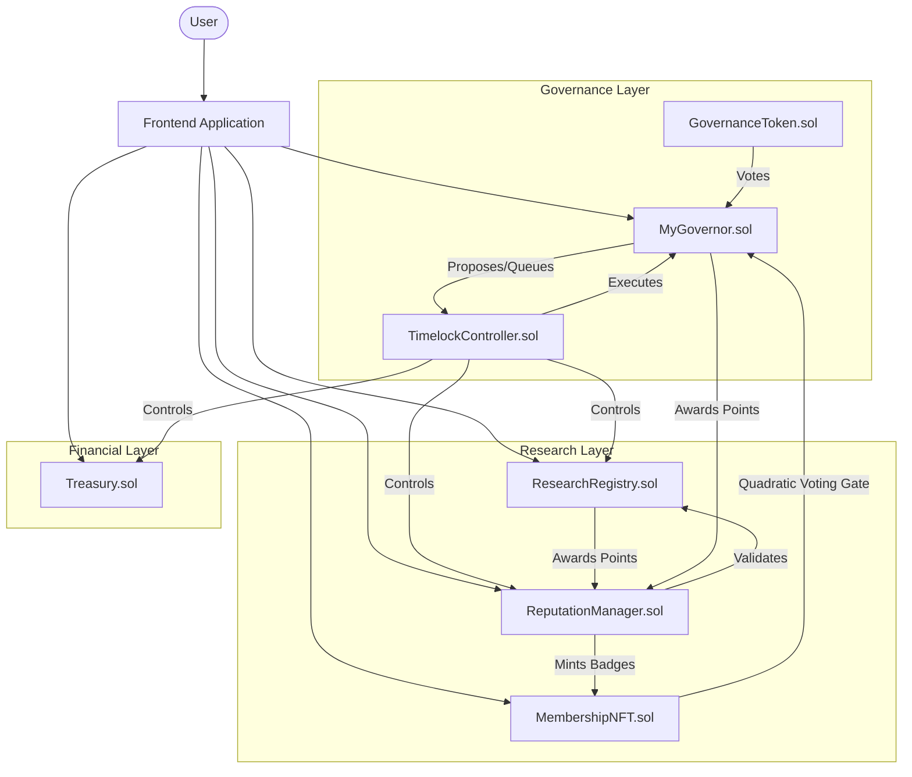

# ResearchDAO System Architecture

## 1. Overview
ResearchDAO is a decentralized platform designed to revolutionize academic research funding and governance. It leverages blockchain technology to create a transparent, merit-based ecosystem for researchers, reviewers, and funders.

## 2. Core Architecture Diagram

## 3. Actor Roles

| Actor | How They Qualify | Key Permissions | Cannot Do |
|-------|-----------------|-----------------|-----------|
| **Researcher** | Holds MembershipNFT | Submit papers, create proposals, vote | Approve own papers, drain treasury directly |
| **Reviewer** | REVIEWER_ROLE granted by governance | Approve/reject papers, earn +25 rep | Create funding proposals alone |
| **Token Holder** | Holds GOV tokens | Vote (standard), create proposals if above threshold | Cast quadratic vote without MembershipNFT |
| **Member** | Holds MembershipNFT | All token holder rights + quadratic voting | Mint their own NFT |
| **Timelock** | Deployed contract (not a person) | Own Treasury, Registry, ReputationManager | Act without passing a Governor vote |
| **Deployer** | Temporary — loses all roles post-deployment | Deploy contracts, grant initial roles | Retain any power after setup complete |

## 4. Component Breakdown

### 4.1 Governance Layer
-   **MyGovernor.sol:** The central governance contract.
    -   **Quadratic Voting:** Uses root of voting power. Requires `MembershipNFT`.
    -   **Proposal Metadata:** Stores IPFS CIDs on-chain.
    -   **Delegation:** Custom cycle detection (`MAX_DELEGATION_DEPTH=5`).
-   **TimelockController.sol:** Enforces delay; owns all system contracts.
-   **GovernanceToken.sol:** ERC20Votes token.

### 4.2 Research Layer
-   **ResearchRegistry.sol:** Stores paper metadata (IPFS CID). Calls ReputationManager hooks.
-   **ReputationManager.sol:** Tracks points, awards NFT Badges.
-   **MembershipNFT.sol:** ERC721 token acting as specific permission gate.

### 4.3 Financial Layer
-   **Treasury.sol:** Holds funds. Supports streaming payments via `fundResearch`. Owned by Timelock.

## 5. Security Model

-   **Timelock Ownership:** All critical contracts are owned by `TimelockController`.
-   **Sybil Resistance:** Quadratic voting requires a `MembershipNFT`.
-   **Reentrancy:** `ReentrancyGuard` on all financial functions (`Treasury.sol`) and registry submissions.
-   **Delegation Safety:** Strict cycle detection enforces a DAG structure for delegation.

## 6. Known Limitations & Design Decisions

| Decision | Rationale | Tradeoff |
|----------|-----------|----------|
| No upgradeability (no proxy) | Simplicity, less attack surface | Bugs require full migration |
| IPFS hash stored, not verified on-chain | Content too large for on-chain storage | Hash can be submitted pointing to wrong content |
| MembershipNFT as Sybil resistance | Simple, on-chain, no oracle needed | Security depends on NFT issuance policy off-chain |
| Single chain only | Simplicity for v1 | No cross-chain governance possible |
| Quadratic voting with ERC20 weight | Reduces whale dominance | Not fully Sybil-proof without stricter identity |

## 7. Deployment Addresses

> **How to populate:** After running `npx hardhat ignition deploy ignition/modules/Governance.ts --network sepolia`, copy the addresses printed to console and update both this file and `dao-frontend/.env`. Do NOT commit private keys or .env files.

| Contract | Address |
|---|---|
| Governor | `[DEPLOY_OUTPUT]` |
| Timelock | `[DEPLOY_OUTPUT]` |
| Treasury | `[DEPLOY_OUTPUT]` |
| Token | `[DEPLOY_OUTPUT]` |
| MembershipNFT | `[DEPLOY_OUTPUT]` |
| ResearchRegistry | `[DEPLOY_OUTPUT]` |
| ReputationManager | `[DEPLOY_OUTPUT]` |
